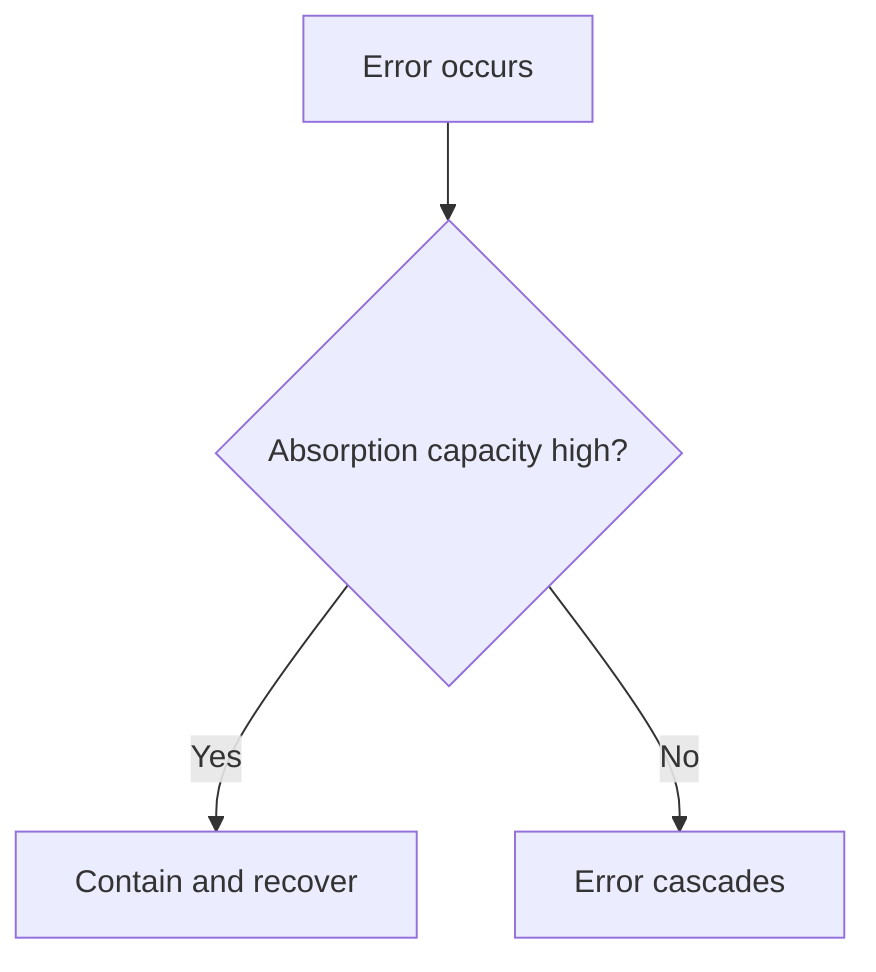

# Absorption Capacity

Absorption capacity is a system's ability to survive being wrong repeatedly.

This concept changes how you read risk.
Two systems can face the same uncertainty and get different outcomes.
A system with high absorption can learn through error without collapsing.
A system with low absorption needs tighter judgement before action.

Absorption capacity comes from buffers, slack, options, recovery paths, and governance that allows correction.
It drops when systems are tightly coupled, redundancy is low, debt is high, or decisions are hard to reverse.

In DRIFT, absorption capacity sets how much precision you need before action.
High capacity allows faster iteration.
Low capacity needs slower and tighter fit checks.

The same error has different outcomes by absorption capacity:

In plain terms: if your system cannot absorb mistakes, lower risk and raise evidence before acting.

Low absorption shows up when small errors create large disruption, recovery takes too much effort, or local faults cascade across dependencies.
High absorption shows up when errors are contained, rollback paths are known, and corrective action does not destabilise the wider system.

Read absorption capacity with [reversibility](reversibility.md).
A system with low absorption and low reversibility needs far higher confidence before commitment.
A system with high absorption and easy rollback can move sooner.
This is the practical basis for [decision_thresholds](decision_thresholds.md).

See also: [reversibility.md](reversibility.md), [decision_thresholds.md](decision_thresholds.md), [judgement.md](judgement.md), [fragility.md](fragility.md), [probe.md](probe.md), [scaling.md](scaling.md), [context.md](context.md)