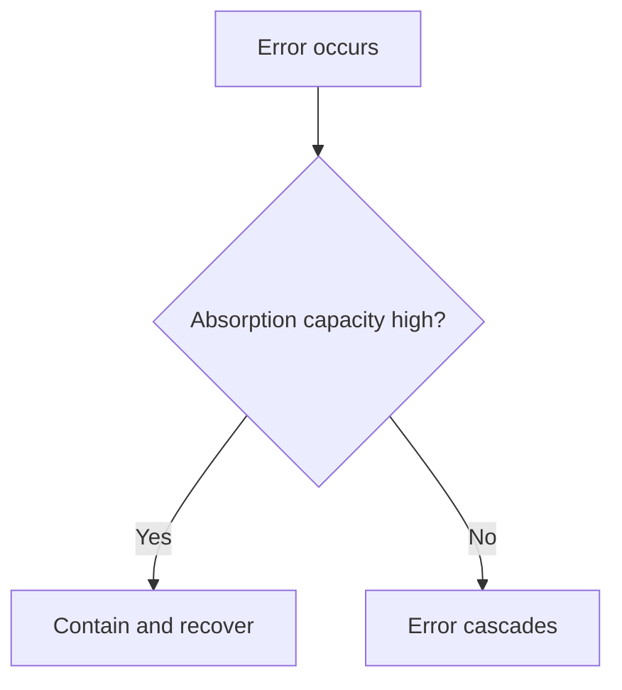

# Absorption Capacity

Absorption capacity is a system's ability to survive being wrong repeatedly.

This concept changes how risk is interpreted. Two systems can face the same uncertainty, but the one with higher absorption capacity can learn through error without collapsing. The other may need much tighter judgement before acting because the cost of being wrong is harder to absorb.

Absorption capacity comes from buffers, optionality, slack, recovery pathways, and governance that allows correction. It is reduced by tight coupling, low redundancy, high debt, and decisions that are hard to reverse.

In DRIFT, absorption capacity helps decide how much precision is required before action. High capacity permits faster iterative movement. Low capacity requires slower, more deliberate fit checks.

The same error has different outcomes by absorption capacity:

In plain terms: if your system cannot absorb mistakes, lower risk and raise evidence before acting.

Low absorption capacity is observable when small errors create outsized disruption, recovery consumes disproportionate effort, or local faults cascade across dependencies. High absorption capacity is observable when errors are contained, rollback paths are known, and corrective action does not destabilise the wider system.

Absorption capacity should always be read with [reversibility](reversibility.md). A system with low absorption and low reversibility needs far higher confidence before commitment than a system with high absorption and easy rollback. This is the practical basis for setting [decision_thresholds](decision_thresholds.md).

See also: [reversibility.md](reversibility.md), [decision_thresholds.md](decision_thresholds.md), [judgement.md](judgement.md), [fragility.md](fragility.md), [probe.md](probe.md), [scaling.md](scaling.md), [context.md](context.md)