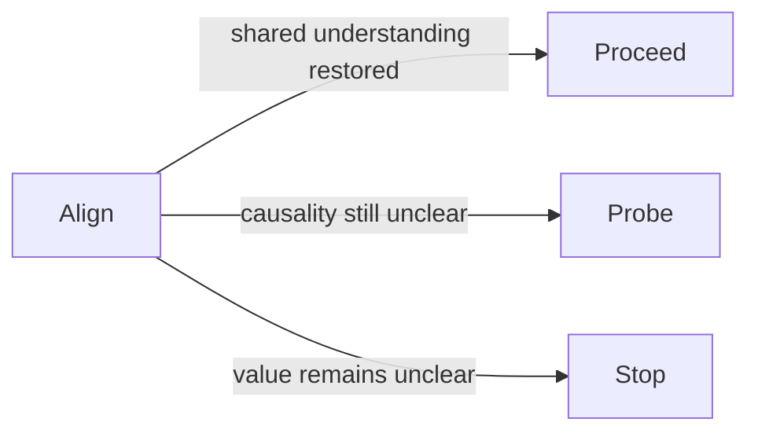

# Align (Context State)

Align means people are not working from the same understanding, even when they appear to agree in meetings.

The signals usually show up in execution. Teams interpret decisions differently. Rework cycles repeat. Check whether progress depends on one leader instead of shared ways of working.

A useful caution from DRIFT is to separate genuine interpretation mismatch from incentive conflict. People may understand the same reality but behave differently because they are measured or rewarded differently.

Align can resolve forward or slip into deeper uncertainty:

In plain terms: use Align to restore shared understanding, then decide whether to move, probe, or stop.

In Align conditions, pushing standardisation or scale too early tends to formalise divergence rather than resolve it.

See also: [context.md](context.md), [alignment.md](alignment.md), [probe.md](probe.md), [misfit.md](misfit.md), [drift_check.md](drift_check.md)