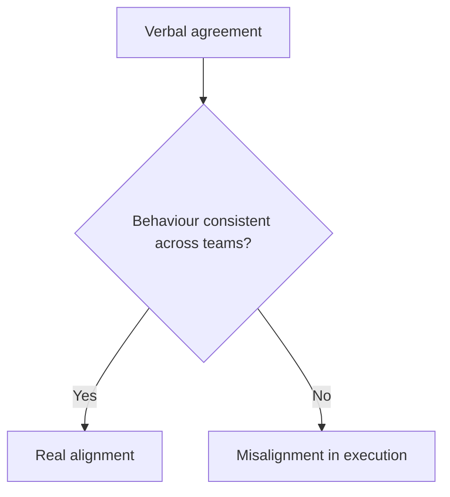

# Alignment

Alignment is consistent behaviour produced by shared understanding.

DRIFT deliberately avoids defining alignment as agreement in conversation. Teams can agree verbally and still execute in conflicting ways. Real alignment is visible in decisions that travel well across boundaries and in actions that stay coherent when local pressure increases.

This distinction is central:

In plain terms: do not trust agreement alone; check how teams actually behave.

Misalignment is often misdiagnosed as communication failure. Sometimes it is. Sometimes it is structural: incentives, targets, or governance pressures reward different behaviours even when understanding is shared.

Alignment has two parts. People need shared meaning, and incentives must support the same behaviour. When behaviour stays fragmented after repeated clarification, treat [incentive conflict](incentive_conflict.md) as a first check.

Alignment is visible in [state](state.md). If observed behaviour is inconsistent across teams despite shared goals, alignment is weak. Alignment also shapes what [observation](observation.md) is reliable. In fragmented organisations, data and frontline experience can point in different directions.

See also: [align_context.md](align_context.md), [incentive_conflict.md](incentive_conflict.md), [context.md](context.md), [misfit.md](misfit.md), [judgement.md](judgement.md), [state.md](state.md), [observation.md](observation.md)