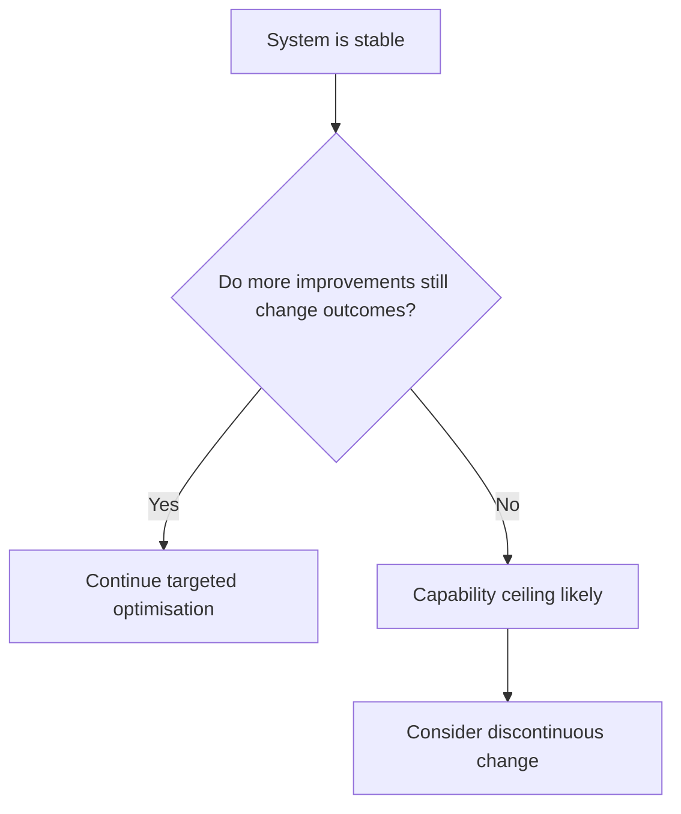

# Capability Ceiling

Capability ceiling is the point where improving the current system no longer produces meaningful value.

This is not simple underperformance. The system may already be stable and efficient. The issue is structural limit: more effort creates smaller returns, while needs keep moving.

Common grouped signals are:

- Diminishing returns from performance work
- Stable delivery but weak system-level outcome change
- More effort with marginal added value
- Better local metrics without wider impact

A simple distinction helps avoid wasted optimisation:

In plain terms: when output quality rises but outcomes stay flat, stop tuning and reconsider the model.

A ceiling usually means one of three things: assumptions are outdated, boundaries are wrong, or a different capability is required. Treat it as a strategic signal, not a delivery failure.

See also: [optimise.md](optimise.md), [external_validity.md](external_validity.md), [value_drift.md](value_drift.md), [programme.md](programme.md), [stop.md](stop.md), [innovation.md](innovation.md), [local_optimisation.md](local_optimisation.md)
