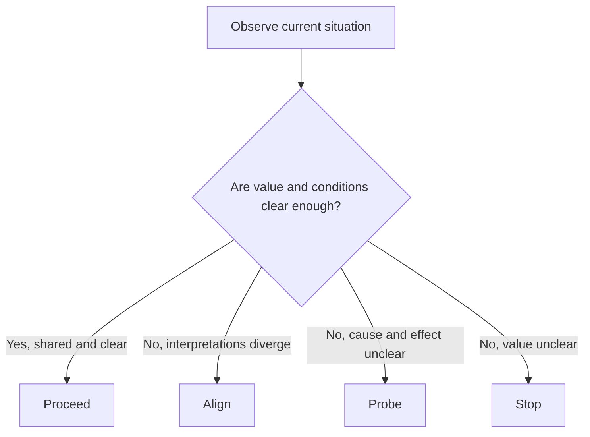

# Context

Context answers one question: should we act now?

In DRIFT, context is about permission and timing, not solution choice. It asks whether the situation is understood enough, [aligned](alignment.md) enough, and valuable enough to justify action at this moment.

This separation matters because organisations often jump straight to "what should we do?" before answering whether action is currently sensible. Acting in unclear or low-value conditions can create momentum without progress.

The context states are **[Proceed](proceed.md)**, **[Align](align_context.md)**, **[Probe](probe.md)**, and **[Stop](stop.md)**. They are not identity labels for teams. They are temporary readings of current conditions based on observable [signals](signals_and_noise.md).

This is the operating decision flow for context:

In plain terms: decide the context state first, then choose intervention type.

**[Proceed](proceed.md)** means the situation is clear enough and aligned enough to move. **[Align](align_context.md)** means people are not operating from the same understanding. **[Probe](probe.md)** means cause and effect are unclear and testing is needed. **[Stop](stop.md)** means value is uncertain enough that continuing may increase waste.

Context and **[capability](capability.md)** are connected but distinct. Context determines whether and when to act. **[Capability state](state.md)** determines what kind of action fits.

Good context decisions also require clarity on **[agency](agency.md)**. Check what can actually be changed. Treat the rest as constraints to navigate.

They also require explicit [decision thresholds](decision_thresholds.md): how much confidence is enough before acting, given reversibility, absorption capacity, and the consequence of being wrong.

Mixed states are also common and should be handled explicitly:

- [align_context](align_context.md) + [probe](probe.md): align on the question first, then test.
- [proceed](proceed.md) + [probe](probe.md): move with bounded scope while learning.
- [align_context](align_context.md) + [stop](stop.md): resolve value disagreement before committing.
- [probe](probe.md) + [stop](stop.md): test value existence before deeper diagnosis.
- [proceed](proceed.md) + [align_context](align_context.md): recheck interpretation alignment before scaling.

In plain terms: if one label does not fit cleanly, use pair states to avoid forcing a false single-state decision.

See also: [proceed.md](proceed.md), [align_context.md](align_context.md), [probe.md](probe.md), [stop.md](stop.md), [state.md](state.md), [alignment.md](alignment.md), [agency.md](agency.md), [decision_thresholds.md](decision_thresholds.md)