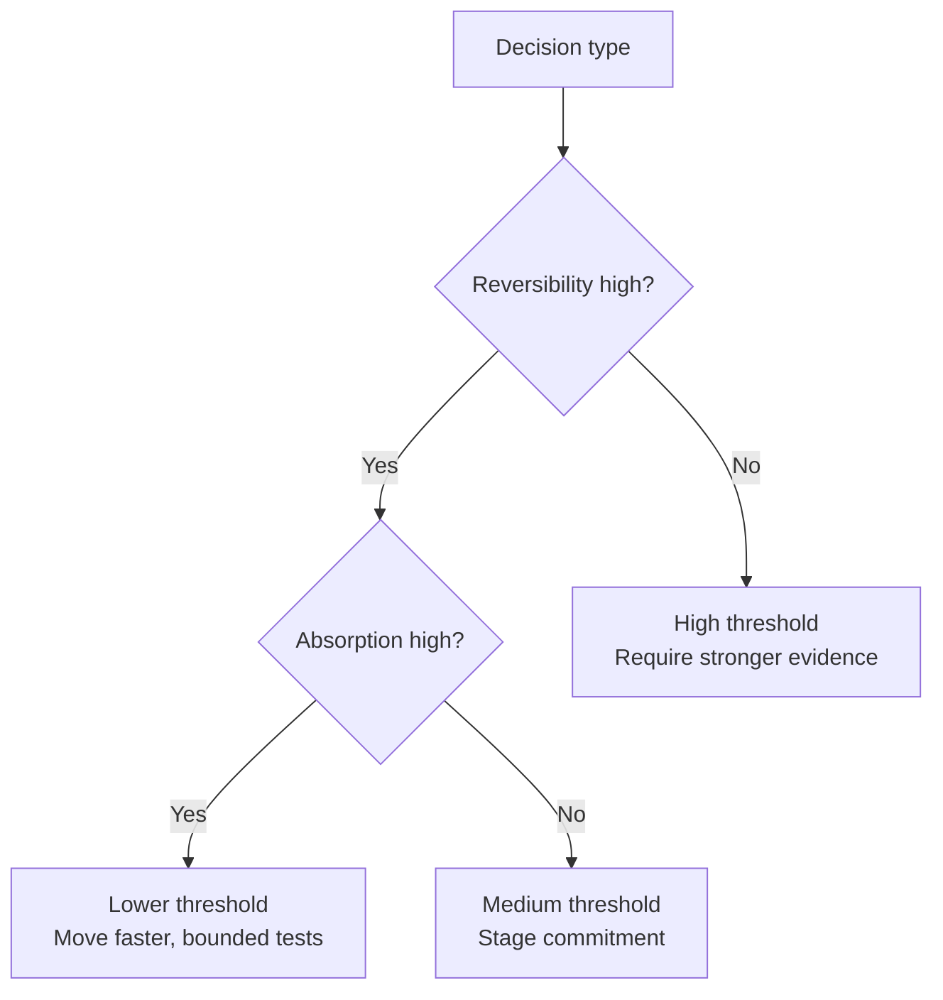

# Decision Thresholds

Decision thresholds are the practical confidence level required before committing to an action.

In DRIFT, one threshold does not fit every decision. Use three checks. How reversible is the decision? How much error can the system absorb? Does delay cost more than being wrong?

This trade-off can be represented as a simple decision map:

In plain terms: the harder it is to recover from error, the more evidence you need before committing.

A useful rule is simple. If reversibility is low and absorption capacity is low, threshold should be high before commitment. If reversibility is high and absorption capacity is high, threshold can be lower and action can move faster.

Most timing failures come from using one threshold for every decision. Teams over-analyse reversible choices and under-test irreversible ones. Both create waste: one through delay, the other through avoidable damage.

Observable signals include repeated delay on low-impact choices, early commitment on hard-to-undo moves, and system stress after small mistakes. These are signs that threshold and risk profile are out of sync.

Decision thresholds do not replace judgement. They sharpen it by making trade-offs explicit: speed versus certainty, learning versus exposure, and opportunity cost versus recovery cost.

See also: [reversibility.md](reversibility.md), [absorption_capacity.md](absorption_capacity.md), [context.md](context.md), [probe.md](probe.md), [proceed.md](proceed.md), [stop.md](stop.md), [judgement.md](judgement.md), [scaling.md](scaling.md)
