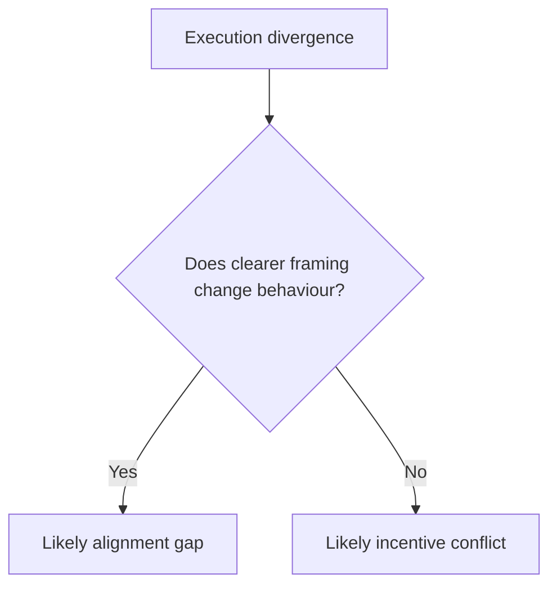

# Incentive Conflict

Incentive conflict happens when people understand the same goal but are rewarded, measured, or constrained to behave differently.

This is easy to misread as poor communication. Teams can agree in meetings and still diverge in execution because their local success measures point in different directions.

A quick way to separate this from [alignment](alignment.md) issues is to test what changes behaviour. If repeated clarification does nothing, but metric or accountability changes do, the main constraint is likely incentive conflict.

This is the core distinction:

In plain terms: when words do not change behaviour, check incentives and constraints.

Common signals include stable meeting agreement with recurring local variation, teams optimizing local KPIs over shared outcomes, and repeated "alignment" workshops with no durable change.

The practical response is structural, not rhetorical. Adjust metrics, ownership boundaries, and risk exposure so expected behaviour is also the easiest behaviour to sustain.

See also: [alignment.md](alignment.md), [align_context.md](align_context.md), [misfit.md](misfit.md), [local_optimisation.md](local_optimisation.md), [context.md](context.md), [judgement.md](judgement.md), [programme.md](programme.md)