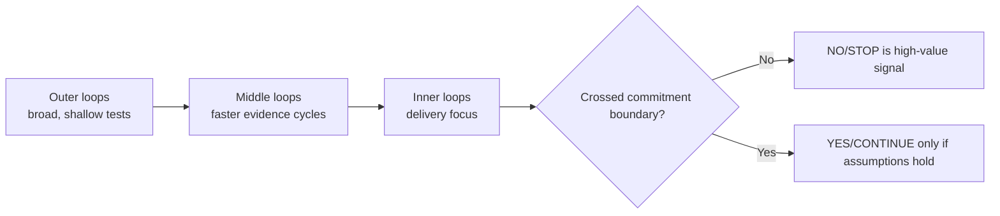

# Innovation Spiral

The innovation spiral describes how solution confidence is built through repeated passes, not one linear gate.

Early loops are broad and shallow. Teams test **Desirable**, **Feasible**, and **Viable** quickly to find whether an idea deserves deeper effort. Later loops are narrower and deeper, with faster evidence cycles and stronger commitment.

The core grouped set is:

- Desirable
- Feasible
- Viable

And the interaction set is:

- Usable = Desirable x Feasible
- Valuable = Desirable x Viable
- Sustainable = Feasible x Viable

This progression is easier to see as a spiral with a commitment boundary:

In plain terms: early NO is useful learning, but late NO is expensive and should trigger foundation checks.

The outer-loop triad also maps to practical test modes:

- Feasible: prototyping (can this be built?)
- Desirable: product or market testing (do people want this?)
- Viable: business-case testing (is this worth operating?)

The sequence can rotate (for example F→V→D→V→D). What matters is not strict order. What matters is complete turns across the grouped dimensions before major scaling.

If any primary dimension returns NO in early loops, [stop](stop.md) is often the highest-quality move.

See also: [innovation.md](innovation.md), [solution_quality.md](solution_quality.md), [quality_mismatch_signals.md](quality_mismatch_signals.md), [probe.md](probe.md), [proceed.md](proceed.md), [stop.md](stop.md), [decision_thresholds.md](decision_thresholds.md)
