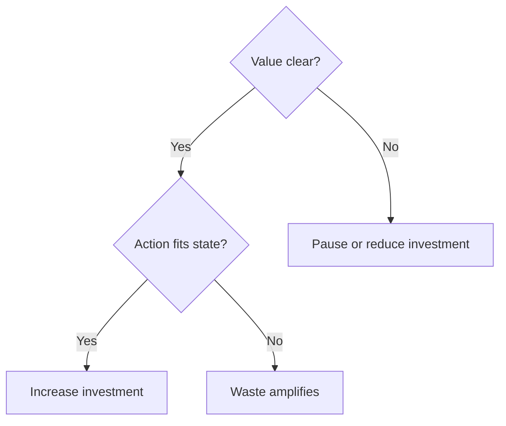

# Investment vs Fit

Investment vs fit separates two questions that are often mixed:

- is this work worth doing now?
- does the action type fit the current system state?

Only after both are clear should effort be increased.

When investment rises without fit, common patterns appear:

- activity grows while outcomes stay flat
- teams optimise the wrong thing
- problems move rather than resolve
- sunk-cost arguments replace value evidence

The interaction is straightforward:

- fit: state-action match
- investment: effort, budget, and attention applied

This relationship can be mapped as:

In plain terms: do not invest harder until value and fit are both visible.

A useful check before adding effort is: is behaviour improving in the system, or only effort visibility in reports and plans?

See also: [value.md](value.md), [stop.md](stop.md), [context.md](context.md), [stabilise.md](stabilise.md), [probe.md](probe.md), [align_context.md](align_context.md), [programme.md](programme.md), [local_optimisation.md](local_optimisation.md)
