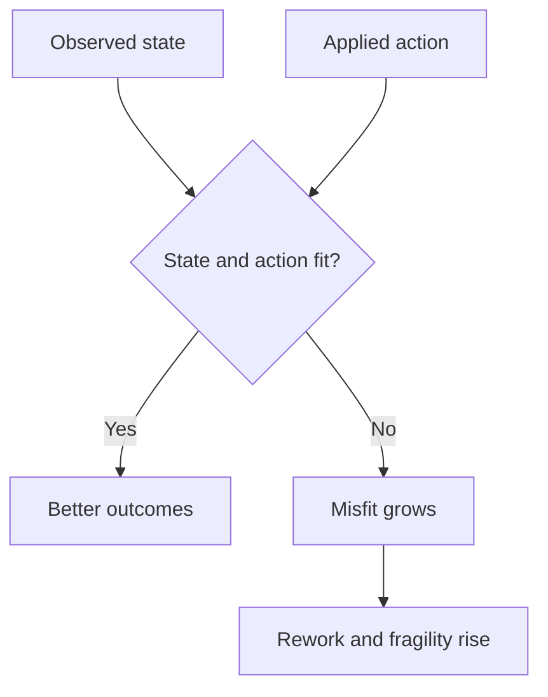

# Misfit

Misfit is the gap between observed system **[state](state.md)** and the action being applied.

This is the core failure pattern in DRIFT. Most failure does not come from lack of effort. It comes from applying the wrong kind of effort to the current state of the system.

If a **[capability](capability.md)** is unstable and the organisation applies **[optimisation](optimise.md)**, inconsistency gets amplified. If teams are **[misaligned](alignment.md)** and leaders push standardisation at scale, divergence gets formalised. If **[value](value.md)** is unclear and execution intensity increases, waste compounds.

A simple fit map makes this easier to see:

In plain terms: check state before action, or you scale the wrong move.

Misfit is often gradual. It does not always fail loudly at first. It appears as recurring friction, repeated rework, unstable results, and rising coordination overhead. Over time those small mismatches accumulate into systemic **[fragility](fragility.md)**.

Some misfit is quality-structure mismatch rather than action-state mismatch. For example: strong viability and feasibility with weak desirability often shows up as adoption push and low pull.

The useful move is not to search for a perfect intervention. It is to restore fit between state and action. That usually means slowing down enough to **[observe](observation.md)** clearly, then selecting the action type that matches what the system currently needs.

See also: [state.md](state.md), [observation.md](observation.md), [solution_quality.md](solution_quality.md), [quality_mismatch_signals.md](quality_mismatch_signals.md), [capability.md](capability.md), [stabilise.md](stabilise.md), [rationalise.md](rationalise.md), [optimise.md](optimise.md), [context.md](context.md), [alignment.md](alignment.md), [fragility.md](fragility.md), [value.md](value.md)