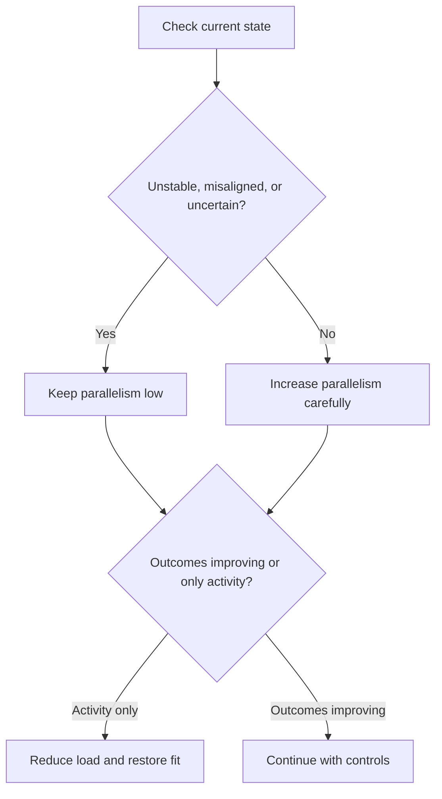

# Parallelism

Parallelism is how much change a system is trying to run at once.

The limiting factor is not just people or planning capacity. It is the system's ability to absorb interaction between changes without losing coherence.

The core interaction is simple:

- system state (stable, misaligned, uncertain, fragile)
- change load (how many things are changing together)

When load exceeds absorption, behaviour usually shifts in predictable ways:

- decisions get reopened
- fixes create new problems
- teams compensate locally
- activity rises without outcome improvement

These are not separate issues. They are overload signatures.

A practical state-to-load guide is:

- unstable: very low safe parallelism
- misaligned: low safe parallelism
- uncertain: low safe parallelism
- stable and aligned: higher controlled parallelism

This can be represented as a simple rule map:

In plain terms: parallelism should expand with stability and clarity, not ahead of them.

Stacked programmes are a specific overload signal: coordination layers and reporting increase while delivery outcomes do not. At that point, the system is optimising for visibility, not movement.

See also: [context.md](context.md), [scaling.md](scaling.md), [programme.md](programme.md), [fragility.md](fragility.md), [misfit.md](misfit.md), [signals_and_noise.md](signals_and_noise.md), [stabilise.md](stabilise.md), [absorption_capacity.md](absorption_capacity.md)
