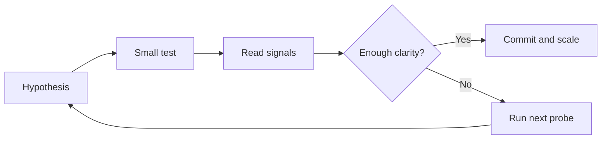

# Probe

Probe is the context state where cause and effect are unclear enough that deliberate testing is needed before large commitments.

Probe conditions are common in complex systems. The same action can produce different outcomes, experts can disagree with plausible explanations, and available data can support multiple interpretations.

This is the bounded probe cycle:

In plain terms: run small tests first, then scale only when signal quality improves.

Probing is not delay for its own sake. It is disciplined learning to reduce uncertainty. Good probing should decrease uncertainty over time. If experimentation increases noise without clearer understanding, the system is becoming more confused, not more informed.

Probe is especially important for innovation work and any discontinuous change where value assumptions are not yet proven.

Probe is also where [decision thresholds](decision_thresholds.md) are calibrated in practice: when confidence is low, scope should stay bounded until signal quality improves.

In Probe conditions, quality testing is intentionally light: test Desirable and Feasible first, and avoid full solution scoring until evidence quality improves.

See also: [context.md](context.md), [solution_quality.md](solution_quality.md), [quality_mismatch_signals.md](quality_mismatch_signals.md), [uncertainty.md](uncertainty.md), [innovation.md](innovation.md), [signals_and_noise.md](signals_and_noise.md), [judgement.md](judgement.md), [decision_thresholds.md](decision_thresholds.md)