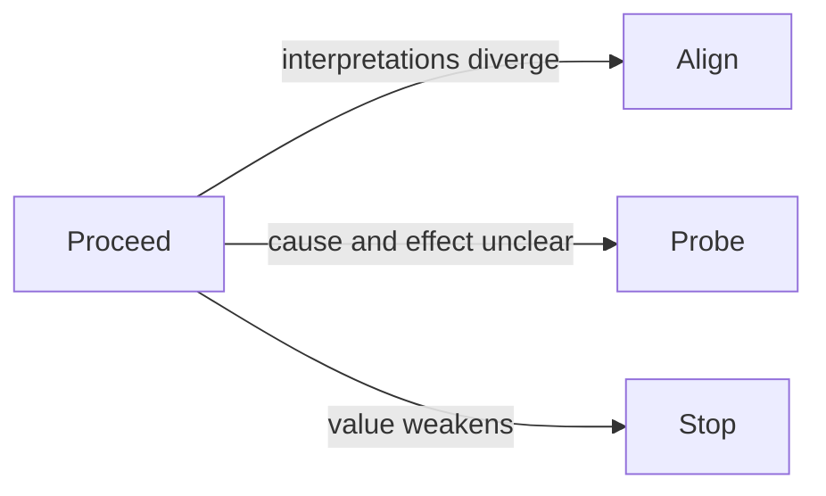

# Proceed

Proceed is the context state where understanding and alignment are strong enough to act.

Proceed does not mean certainty. It means there is enough shared understanding, enough signal quality, and enough confidence in value to move without creating unnecessary confusion.

Proceed is best treated as a state you can move in and out of:

In plain terms: keep acting, but re-check signals so you can switch state early.

Typical signals include decisions that are not repeatedly reopened, consistency between data and frontline interpretation, and execution that does not splinter across teams. These point to [alignment.md](alignment.md), which is the consistency of behaviour needed to sustain action.

Proceed is a permission state, not an action type. It still requires choosing the right capability intervention and checking [solution quality](solution_quality.md) before scaling.

See also: [context.md](context.md), [solution_quality.md](solution_quality.md), [quality_mismatch_signals.md](quality_mismatch_signals.md), [capability.md](capability.md), [align_context.md](align_context.md), [probe.md](probe.md), [stop.md](stop.md), [alignment.md](alignment.md)