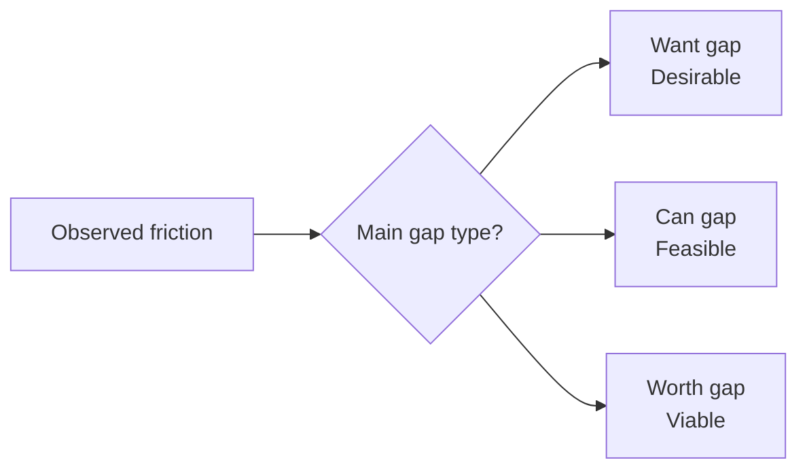

# Quality Mismatch Signals

Quality mismatch signals show where solution quality dimensions are out of balance before failure becomes obvious.

The fastest patterns come from observed behaviour:

- Push required to drive adoption: usually Feasible and Viable, but weak Desirable.
- Persistent delivery friction: usually Desirable and Viable, but weak Feasible.
- Chronic justification effort: usually Desirable and Feasible, but weak Viable.

These can be scanned with a simple decision prompt:

In plain terms: ask whether the problem is want, can, or worth, then choose the next test accordingly.

These signals should challenge assumptions, not replace judgement. If evidence is weak, use a bounded [probe](probe.md). If value is weak or declining, consider [stop](stop.md) and [value_drift](value_drift.md) before adding more improvement effort.

See also: [solution_quality.md](solution_quality.md), [probe.md](probe.md), [proceed.md](proceed.md), [misfit.md](misfit.md), [value.md](value.md), [value_drift.md](value_drift.md), [decision_thresholds.md](decision_thresholds.md)
