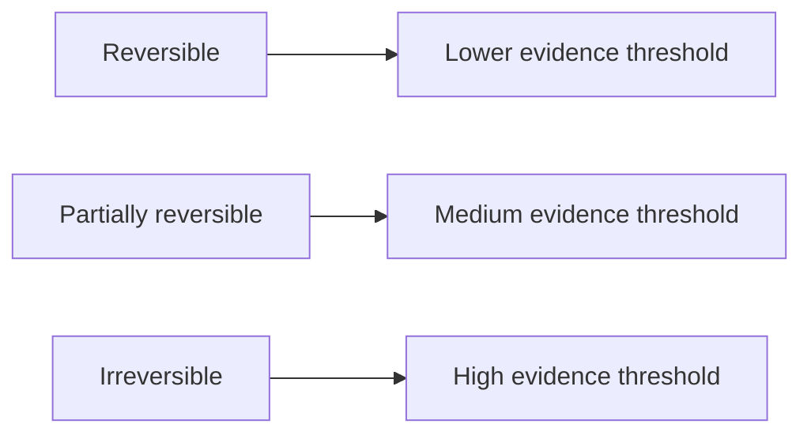

# Reversibility

Reversibility is how easily an action can be undone if it turns out to be wrong.

DRIFT treats reversibility as a key determinant of decision risk. The cost of being wrong depends less on whether uncertainty exists and more on how hard recovery would be.

Reversible decisions allow faster movement with lower precision. Irreversible decisions demand stronger evidence and tighter fit before commitment. Partially reversible decisions sit between those poles: rollback is possible, but costly or incomplete.

Decision classes by reversibility:

In plain terms: the harder recovery is, the more evidence you need before commitment.

This does not mean reversible actions are always good. Repeated low-quality reversible actions can still create drag and confusion. Check reversibility first because it changes decision risk under uncertainty.

In practice, reversibility should shape the required confidence threshold before action. If rollback is easy and consequences are contained, action can be faster and more iterative. If rollback is hard and consequences propagate, decisions need tighter evidence before commitment.

Common failure pattern: reversible decisions are treated as irreversible, slowing learning and losing opportunity. The opposite failure is worse: irreversible decisions are treated as easy-to-correct experiments, creating long-tail damage that is expensive to unwind.

See also: [absorption_capacity.md](absorption_capacity.md), [decision_thresholds.md](decision_thresholds.md), [judgement.md](judgement.md), [probe.md](probe.md), [proceed.md](proceed.md), [stop.md](stop.md), [uncertainty.md](uncertainty.md), [context.md](context.md)