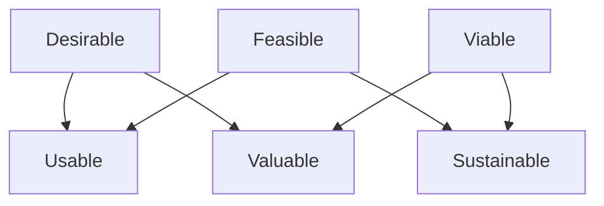

# Solution Quality

Solution quality in DRIFT tests whether an action is sound before scaling effort.

It uses three primary dimensions:

- Desirable: do users or stakeholders actually need or choose this?
- Feasible: can this be delivered reliably with current capability and constraints?
- Viable: is this worth doing commercially or strategically?

It also checks three interactions:

- Usable = Desirable x Feasible
- Valuable = Desirable x Viable
- Sustainable = Feasible x Viable

This relationship is easier to see as a map:

In plain terms: strong single dimensions are not enough; the combinations decide whether the action holds in practice.

Use this model with context gates, not instead of them. In [stop](stop.md) or [align](align_context.md), quality scoring is usually premature. In [probe](probe.md), test Desirable and Feasible lightly. In [proceed](proceed.md), run the full quality check.

See also: [quality_mismatch_signals.md](quality_mismatch_signals.md), [context.md](context.md), [proceed.md](proceed.md), [probe.md](probe.md), [misfit.md](misfit.md), [value.md](value.md), [capability.md](capability.md)
