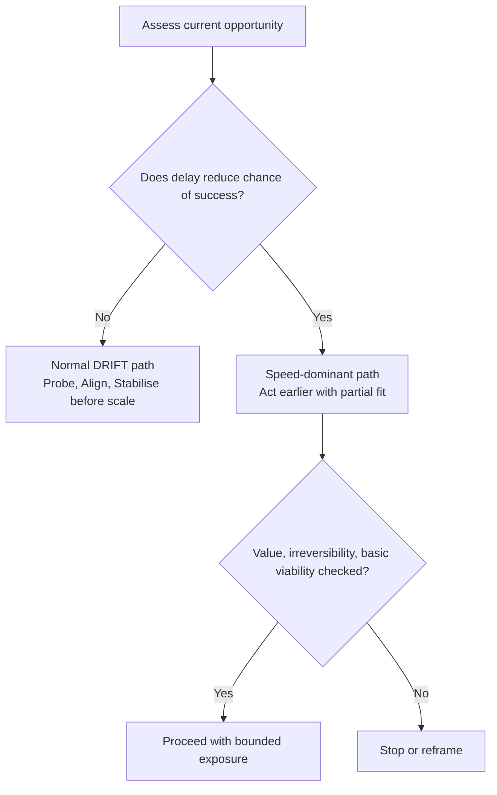

# Speed-Dominant Contexts

Speed-dominant contexts are situations where delay reduces the chance of success.

Most DRIFT use assumes waiting improves understanding. This page captures the exception: in some environments, waiting does not improve decisions enough to offset lost position.

The practical test is simple: does waiting improve the outcome, or reduce the probability of success?

The critical interaction is between two factors:

- uncertainty (how unclear cause and effect is)
- time sensitivity (how quickly opportunity decays)

Signals are structural, not emotional urgency. Look for grouped evidence:

- early position creates durable advantage
- scale changes behaviour and learning quality
- outcomes follow power-law concentration
- opportunity windows are time-bound
- the system can absorb temporary inefficiency

In these conditions, DRIFT is not bypassed. It is selectively relaxed.

- Relax: full alignment, full stability, and small-sample purity
- Keep mandatory: value check, irreversibility awareness, basic viability

This exception can be represented as a decision split:

In plain terms: move faster only when delay destroys advantage, and keep hard safety checks in place.

Misuse risk is high. False race conditions can justify reckless speed and compound fragility. Always separate real external race pressure from internal urgency theatre.

See also: [context.md](context.md), [decision_thresholds.md](decision_thresholds.md), [judgement.md](judgement.md), [probe.md](probe.md), [stop.md](stop.md), [innovation.md](innovation.md), [innovation_spiral.md](innovation_spiral.md), [fragility.md](fragility.md)
