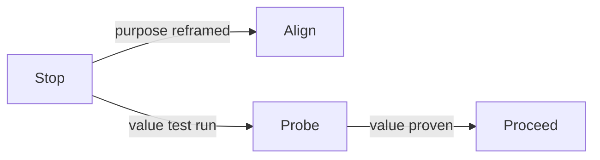

# Stop

Stop is the context state where value is unclear enough that continuing work is likely to increase waste.

Stop is not failure. It is a decision to avoid compounding effort in low-value conditions. In practice, it often appears when work persists through habit, ownership is unclear, outputs are weakly used, or improvement effort fails to move outcomes.

Stop can mean ending work, pausing work, narrowing scope, or reframing purpose. The key point is that action intensity should not rise when value clarity falls.

Stop is a reset point, not always a terminal state:

In plain terms: pause first, then restart only after value is clear again.

High-performing teams can resist Stop because it feels like loss of momentum. DRIFT treats it as a quality decision when evidence supports it.

See also: [context.md](context.md), [value.md](value.md), [programme.md](programme.md), [drift_check.md](drift_check.md), [external_validity.md](external_validity.md)