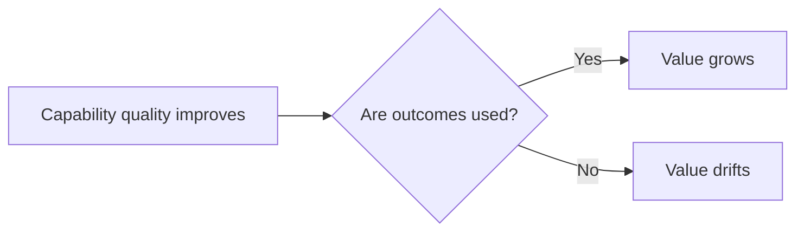

# Value

In DRIFT, value exists only when outputs are used to create impact.

This sounds obvious, but it is frequently violated in practice. Teams often treat completed work, delivered features, or successful handovers as value in themselves. Those are outputs. They only become value when someone uses them in a way that changes outcomes in a meaningful direction.

Value is therefore behavioural and contextual. It is behavioural because it appears in what people do, not just what they say. It is contextual because something can be valuable in one environment and irrelevant in another. Check external demand regularly. A capability can be internally strong while external value declines.

Use this split to avoid confusing delivery progress with value:

In plain terms: do not call it value until usage and impact are visible.

## Value drift

One key risk in DRIFT is [value drift](value_drift.md): the system keeps improving at something that matters less over time. This can happen quietly. Efficiency increases. Internal metrics improve. Teams become highly competent. Yet customer behaviour does not move, or moves away. The organisation gets better at the wrong thing.

Value drift is why DRIFT includes a Stop context and an external validity check. The question is not only "can we do this well?" but "is this still worth being good at?"

## How to test value

The most reliable tests are observable:

- Are outcomes actually being used?
- Is willingness to pay stable, increasing, or declining?
- Is usage behaviour strengthening, flat, or weakening?

When value signals weaken, the right response is not automatically capability optimisation. It may be to pause, reframe, narrow scope, or stop.

## Value and progress are different

Progress describes movement in capability quality. Value describes impact created in the world. They often move together, but not always. You can have progress without value, such as better delivery of low-need outputs. You can also have temporary value without progress, such as short-term gains sustained by unsustainable effort.

See also: [value_drift.md](value_drift.md), [progress.md](progress.md), [context.md](context.md), [stop.md](stop.md), [programme.md](programme.md), [drift_check.md](drift_check.md)
