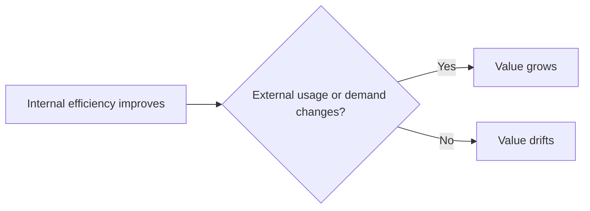

# Value Drift

Value drift is when a system gets better at delivery while becoming less relevant to real demand.

This is a common failure pattern in mature teams. Internal quality, speed, or efficiency improves, but customer behaviour, usage, or willingness to pay does not move with it.

Value drift matters because it can hide behind good performance reporting. Teams look successful on internal metrics while outcomes lose external impact.

This is the practical dynamic:

In plain terms: if customers do not change behaviour, internal gains may be improving the wrong thing.

Fast tests are straightforward. Ask whether better execution is visible outside the system, whether demand is strengthening or weakening, and whether the improved outcome is actually used.

When value drift is visible, the next move is often [stop](stop.md), [probe](probe.md), or reframing. It is usually not more [optimise](optimise.md) work.

See also: [external_validity.md](external_validity.md), [value.md](value.md), [stop.md](stop.md), [programme.md](programme.md), [local_optimisation.md](local_optimisation.md), [context.md](context.md), [capability.md](capability.md)
